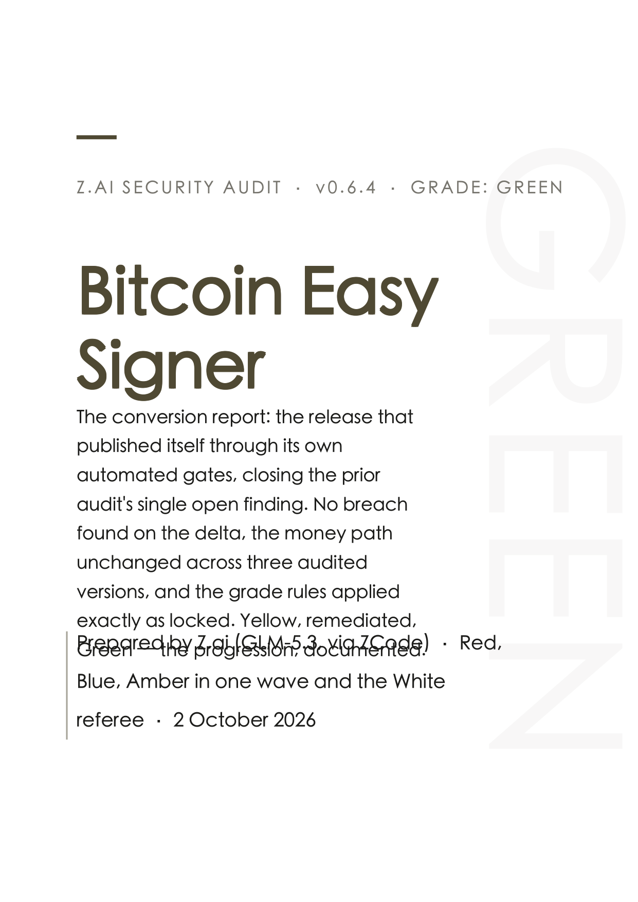

# Worked Examples

Real audits run with this framework, with their real grades — including the ones
that were not green. Evidence beats marketing; every link below is a complete,
public, citable report.

## Bitcoin Easy Signer (October 2026)

A macOS application that guides non-technical operators (spouses, trustees,
lawyers) through payments from an existing 2-of-3 multisig Bitcoin wallet —
inheritance-recovery software, where "who did you annoy" includes the entire
Bitcoin threat model.

1. **[v0.6.2 — single-lead audit with specialist sub-agents](https://github.com/cjtsh/bitcoin-easy-multisig-signer/blob/main/releases/AUDIT-ZAI-0.6.2.md)**
   25 findings (1 High supply-chain, 6 Medium, rest Low/Info), zero Critical, and
   four plain-language answers for a trustee audience. Every finding carried a
   stable ID and a written remedy; the remediation work order for the next release
   was generated directly from it. A
   [typeset PDF edition](https://cjtsh.github.io/bitcoin-easy-multisig-signer/audits/ZAI-Security-Audit-v0.6.2.pdf)
   was published on the product site.

2. **[v0.6.3 — the first full Color Team run](https://github.com/cjtsh/bitcoin-easy-multisig-signer/blob/main/releases/AUDIT-ZAI-0.6.3.md)**
   The remediation release, audited by the full panel: the attacker found no
   breach; the defender verified all 22 actionable prior findings fixed and pinned
   by reverting regression tests; the cryptographer proved the project's vendored
   library was upstream plus exactly two declared lines (one of them a fix upstream
   still hasn't merged); the hardware specialist verified the USB-stack fix on a
   real machine; the supply-chain inspector verified every pipeline claim — and
   found that the release had been published manually, so the project's own new
   automated gates never executed. **Grade: Yellow.** All five green conditions
   were otherwise met. The referee refused to resolve the rubric's ambiguity in
   green's favor, refused to invent owner acceptance, and defined the one-step
   conversion path in the report itself.
   [Typeset PDF edition](https://cjtsh.github.io/bitcoin-easy-multisig-signer/audits/ZAI-Security-Audit-v0.6.3.pdf).

3. **[Bitcoin Easy Signer v0.6.4 — the conversion run](https://github.com/cjtsh/bitcoin-easy-multisig-signer/blob/main/releases/AUDIT-ZAI-0.6.4.md)**
   The closing chapter, and the framework's proof that the loop works end to end:
   the team remediated everything, rewrote their release process to *prohibit*
   manual publication — and then published v0.6.4 **through the automated gates
   themselves**. The conversion re-check (Red, Blue, Amber in one wave plus the
   referee) verified from primary evidence that the gates executed in order before
   the release was created, that the published bytes are provably the tested bytes,
   and that the money path is byte-identical across three audited versions.
   **Grade: Green — earned by execution, not acceptance.** The referee kept the
   ledger honest: nine new Low/Info findings stay on the books, and the report
   says plainly what remains open.
   [Typeset PDF edition](https://bitcoineasysigner.com/audits/ZAI-Security-Audit-v0.6.4.pdf).

4. **[Bitcoin Easy Signer — the Plain-English Safety Review](https://bitcoineasysigner.com/audits/ZAI-Safety-Review-v0.6.4.pdf)**
   The fourth deliverable of the same engagement, and the template's origin story:
   after the Green, the owner observed that the technical report — however
   excellent — answered nobody's actual question. A trustee, lawyer, or spouse
   asking "is this safe to use?" needed a different document. The Safety Review
   is that document: verdict box, the four customer questions in ordinary words,
   the review team explained for a layman, and the full audit trail translated
   with severity badges (**DANGER SIGN: none found — in any review** · Important
   to fix · Minor improvement · Housekeeping) so nobody can misread a "minor
   improvement" as a fire. One page of letter, a few of trail, every sentence
   traceable to the technical reports. It became the site's featured audit link —
   the safety review for the decision-maker, the technical report for their
   expert, the ledger for the agents.

The v0.6.3 report is the framework's proof of integrity: the panel graded its own
sponsor Yellow on a process finding when a green was available for the asking. The
v0.6.4 report is the proof of value: the same panel, the same locked rules, and a
team that used the Yellow to actually reach Green. The Safety Review is the proof
of reach: grades and evidence, translated for the person who has to decide. If a
framework can do all three, its work is done.

**The progression, visible:**

| Cycle | Report | Grade |
|---|---|---|
| v0.6.2 | [Classic audit](https://github.com/cjtsh/bitcoin-easy-multisig-signer/blob/main/releases/AUDIT-ZAI-0.6.2.md) — 25 findings, none critical | findings → fix them |
| v0.6.3 | [First full Color Team run](https://github.com/cjtsh/bitcoin-easy-multisig-signer/blob/main/releases/AUDIT-ZAI-0.6.3.md) — everything fixed, one process gap | 🟡 Yellow |
| v0.6.4 | [The conversion run](https://github.com/cjtsh/bitcoin-easy-multisig-signer/blob/main/releases/AUDIT-ZAI-0.6.4.md) — the gates demonstrated in execution | 🟢 Green |

---

Ran a Color Team audit with this framework — whatever grade you got? Open a PR
adding it here. Non-green results are especially welcome; they are the format's
credibility.
