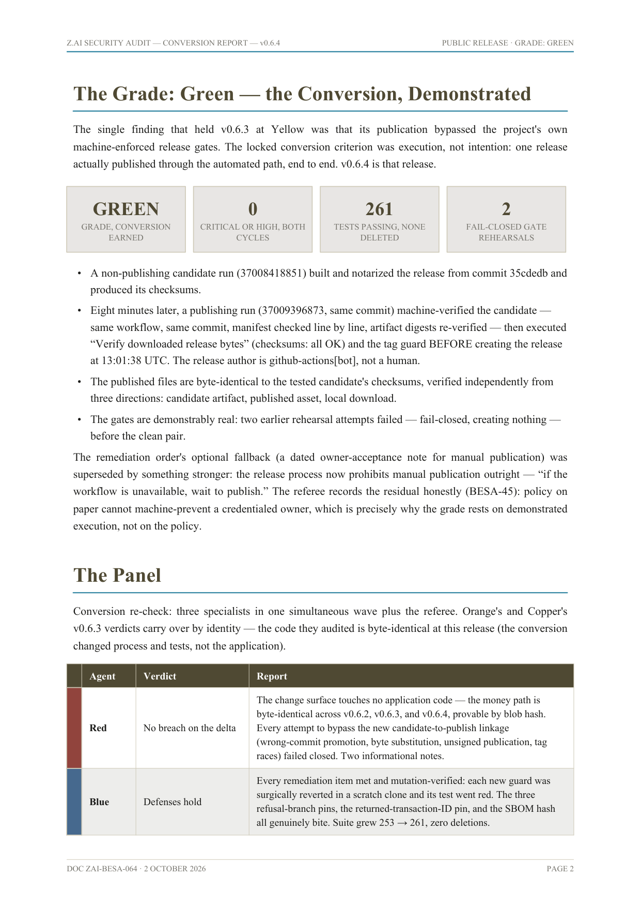

# AI Color Team Audit Framework

**The new standard for software audits using agentic tools.**

Version 1.1.1 · MIT License

Maintained by **Bitseeker LLC**.

Five specialist AI agents and a White referee independently audit your software —
with a grade rubric locked in writing **before** the audit begins, applied
mechanically after, and a publication gate nothing unfair survives. The whole
method ships as drop-in agent files: paste them into any AI coding tool and run.

**Never copy these runbooks into your repository.** Hand them to the agent — attach the
file, or paste its contents. The only file that lands in your repo is
`<repo>-colorteam-audit-plan.md`, and it is named after your repo precisely so it
cannot collide with anything. An `AGENT.md` in your repo is *your* instructions to
your own tools; this framework deliberately does not use that name.

## How it works — three steps, two sets of eyes

```
  STEP 1 - THE SURVEY                        agent one   (model A)
  -------------------
  colorteam-surveyor.md   +   your repo
  say: "Conduct a survey of this repository."
                 |
                 v
  XYZ-colorteam-audit-plan.md                written into your repo root

                 |
                 v

  STEP 2 - YOU REVIEW                        no AI involved
  -------------------
  read XYZ-colorteam-audit-plan.md, fix what only you know, sign it.
  It locks.

                 |
                 v

  STEP 3 - THE AUDIT                         agent two   (model B, must differ from A)
  ------------------
  colorteam-auditor.md   +   your repo   +   XYZ-colorteam-audit-plan.md
                 |
                 v
  the graded report
      the technical report   -  for engineers
      the safety review      -  for everyone else
      the findings ledger    -  for agents
```

**Step 1 runs on a different model than step 3, and that is the point.** The
surveyor decides what is even in scope. If one model writes the plan and then audits
against it, the same blind spot sits on both sides of the handoff: the panel works
faithfully from an incomplete scope, finds nothing wrong with what it can see, and
grades it CLEARED on software nobody examined.

**The handoff is one file.** The surveyor writes `<repo>-colorteam-audit-plan.md`; you read
it, correct it, and sign it; the panel audits against it. Nothing else changes hands, and
nothing else is asked of you — signing happens in the same sitting as reading, and the
hashing is the agents' job.

## What you get at the end

A grade, and three documents. The grade is one of three words, decided by the rubric you
locked **before** the audit — not a score, and never an average.

| | |
|---|---|
| ✅ **CLEARED** | All five conditions hold: no open Critical or High; every earlier finding verified fixed, or closed by your own dated acceptance; the stated defenses held and are now pinned by regression tests; the suites passed and the artifacts were re-verified; no new Critical or High appeared. |
| ⚠️ **CONDITIONAL** | Nothing Critical or High, but there are open Mediums beyond what you accepted, a fix that was claimed and not verified, or something a lane could not establish — an unpinned control, unproven logic, unproven edge trust, an unverifiable chain link. That last clause has a limit: it applies to what can reach your shipped software. Something that provably cannot — a docs-only tool, an example nothing deploys — is written down as coverage instead. Honest reading: good software with work remaining. The report names the shortest path to CLEARED. |
| ⛔ **BLOCKED** | One or more Critical or High findings are open — including any proven lane failure: Red demonstrated a breach, Blue found a claimed control that does not hold, Orange proved an invariant wrong, Copper proved an edge the core trusts can deceive, hang, or corrupt it, or Amber showed code you never reviewed can reach a released build without a reviewable bump. **Do not ship.** The report says exactly what and why. |

There is no partial credit. The grade is the **floor** of the panel, so one bad finding
stands no matter how clean the other four lanes were. You get the answer either way — a
BLOCKED report still tells you what held, what did not, and what to fix first.

Then, written in this order:

1. **The technical report** — for engineers and the next auditor. The grade and the
   reasoning, each color's findings with file-and-line evidence, the referee's rulings on
   the load-bearing claims, and an explicit list of what was *not* examined.
2. **The plain-English Safety Review** — for whoever has to decide and does not read code.
   The same grade, the questions a customer actually asks, and the audit trail — every
   sentence traceable to the technical report.
3. **The findings ledger** — for agents and for the next audit. Stable IDs, exact
   locations, machine-checkable, so the next run verifies the fixes instead of
   re-deriving them.

"Nothing found" always means "nothing found within the stated coverage." That coverage
section — what was audited, what was excluded, what nobody examined — is part of the
report, not an appendix.

## The panel

| | |
|---|---|
| 🔴 Red | The attacker — tries to seize, destroy, or alter the declared assets (credentials, personal or payment data, funds, control, availability — whatever your software must protect), by any path. Answers **yes or no, per crown jewel**: BREACH DEMONSTRATED or NO BREACH DEMONSTRATED, and one breach is an automatic ⛔ BLOCKED. Attacks the software, not the machine: a missing firewall is not a finding. Reads no prior conclusions, so it inherits no one's blind spots. |
| 🔵 Blue | The defender — takes every protection your software claims about itself and proves it holds *and* stays held: present, on every path that matters, effective, fail-closed, and pinned by a test Blue has watched go red when the control was broken. Answers **DEFENSES HOLD / DEFENSES HOLD WITH GAPS / DEFENSE BROKEN**, worst control wins. A control that does not hold is an automatic ⛔ BLOCKED; an unpinned one caps the grade at ⚠️ CONDITIONAL. |
| 🟠 Orange | The critical-logic specialist — the logic that enforces an invariant: *"signatures verify"*, *"amounts sum"*, *"a nonce never repeats"*. Proves each one against a definition of correct that lives **outside your code** — a specification, official test vectors, an independent reference implementation, the mathematics — because your code's own comments cannot corroborate your code. Answers **LOGIC PROVEN / LOGIC UNPROVEN / LOGIC WRONG**, worst invariant wins. Wrong logic is an automatic ⛔ BLOCKED; unproven logic caps the grade at ⚠️ CONDITIONAL. |
| 🟤 Copper | The edge specialist — everything the core **trusts but does not control**: clients, transports, devices and drivers, host runtimes, frozen binaries. Assumes each is hostile or broken — it lies, dies, stalls, repeats, or gets substituted — and asks what your code does when its edge betrays it. Answers **EDGE TRUST HOLDS / EDGE TRUST UNPROVEN / EDGE TRUST BROKEN**, per interface, one broken interface failing the lane. Broken trust is an automatic ⛔ BLOCKED; unproven trust caps the grade at ⚠️ CONDITIONAL. Where there is no edge at all it reports **NOT APPLICABLE** — never a clean bill of health. |
| 🟡 Amber | The supply-chain inspector — every step that turns source you wrote into an artifact someone runs: dependencies and their transitive closure, the build and the secrets it can see, packaging, signing, publication, and whether a published version can change under you. Answers **CHAIN HOLDS / CHAIN UNVERIFIED / CHAIN BROKEN**, worst link wins. Broken chain is an automatic ⛔ BLOCKED; an unverifiable link caps the grade at ⚠️ CONDITIONAL. A package that installs cleanly is not proof of legitimacy — that is exactly what a squatter provides. |
| ⚪ White | The referee — sees everything and re-derives every claim the verdict rests on, whether it's a finding or a clean bill of health. Computes the grade from the rubric instead of choosing it, has no power to raise or lower a lane's sub-verdict, and answers **PUBLISH / PUBLISH WITH STATED GAPS / DO NOT PUBLISH**. Also owns the coverage section, because a report that doesn't say where it stopped is claiming more than it did. |

### 🔴 Red, in more detail

**Red is the only color that attacks, and the only one whose answer is yes or no.** It
reads your code adversarially, lists every input the software accepts and every trust
boundary it crosses, and tries to drive a hostile input all the way to a declared
asset. It answers once per crown jewel — **BREACH DEMONSTRATED** or **NO BREACH
DEMONSTRATED** — with the exact path and the code at every hop.

**It attacks the software, not the machine.** No host or network scanning, no attacks
against a running system, no operating-system or hardware testing, and no auditing a
dependency's internals. Your repository and its declared dependencies are the whole
world. A path that needs a hop outside — an unpatched OS, a missing firewall, a third
party's own bug — is recorded as an exclusion, not a finding.

**"NO BREACH DEMONSTRATED" is not a pass.** It means Red could not fail the audit,
not that the software is good. The other four lanes can still hold the grade down on
their own.

### 🔵 Blue, in more detail

**Blue audits the armor, not the attacker.** It starts from every protection your
software claims about itself — in the README, the docs, the comments, docstrings,
the configuration, and your audit plan — and publishes that list. A protection the
software claims but Blue left off the list is itself a finding.

**Every control faces five tests.** Is it present? Does it run on every path that
touches the asset, not just the happy one? Does it actually stop what it claims to
stop? When it errors, does it deny? And is it pinned?

**"Pinned" means Blue broke it and watched the test go red.** A test that exists is
not evidence; a test that can fail is. Blue does this in a disposable copy and
reverts — never against real code, never in production. If the test stays green when
the control is broken, the finding is *a control claimed to be tested that cannot
fail*. If the suite cannot run at all, the control is **unpinned, not demonstrated** —
a gap, never a pass.

**A broken control is an automatic ⛔ BLOCKED. An unpinned one caps the grade at
⚠️ CONDITIONAL.** Blue's verdict is the worst control on the table, never the
average.

### 🟠 Orange, in more detail

**Orange starts from what must always be true** — not from the files. The invariants
the software depends on: every signature verifies, amounts sum, a nonce never repeats, a
session cannot be replayed, the balance never goes negative. It publishes that list
first. A critical path with no written-down invariant is itself a finding, because if
nobody ever said what correct means, nobody can say the code is correct.

**The problem Orange exists to solve: AI-generated code looks right.** Reading it and
deciding it seems fine is exactly the test it was built to pass. So Orange is not
allowed to decide anything by reading. Every invariant must be checked against a
definition of correct that lives **outside your implementation** — a specification,
published test vectors, an independent reference implementation, or the mathematics,
written out and shown.

**Your code's own comments are not evidence.** An implementation and a comment written
by the same model come from the same source, so they cannot corroborate each other.
Neither can its own docs, its own tests, or "it looks right".

**Orange writes down the expected answer before reading the implementation**, then runs
the code against it — and exercises the boundaries AI code tends to miss: zero, one,
negative, maximum, exactly-at-limit, just-over-limit, empty, duplicate, replayed,
out-of-order, non-canonical encodings. It also reads the diff of every critical
dependency, because a changelog is the dependency author's claim, not evidence. With no
previous audit there is no delta, and Orange says so.

**LOGIC WRONG is an automatic ⛔ BLOCKED. LOGIC UNPROVEN caps the grade at
⚠️ CONDITIONAL** — "we could not establish it" is never CLEARED, and the report has to
say which it was.

### 🟤 Copper, in more detail

**Copper covers what the core trusts but does not control.** Not "the parts outside the
repo" — what the core depends on and cannot see, verify, or replace: clients, the
transports and whatever answers at the other end, devices and drivers, the host runtime
it leans on, and frozen or adopted binaries shipped but not built here.

**If there is no edge, Copper says NOT APPLICABLE**, with the reason, in the coverage
section — never *"edges sound."* A lane with nothing to look at contributes nothing to
the grade, and the report has to show that it contributed nothing.

**Copper assumes the edge is hostile or broken.** It is not auditing your browser; it is
auditing what your code does when the browser lies to it. Five behaviours at every
interface: the edge **lies** (returns a value the core did not earn), **dies**
(disconnects mid-operation), **stalls** (hangs or answers arbitrarily slowly),
**repeats** (replays or reorders), or **gets substituted** (counterfeit device, patched
client, older binary). The core passes only if it survives all five.

**Version identity is a first-class check:** how does the core know which version or
vendor it is talking to — and can it tell at all? If it cannot, that is the counterfeit
finding.

**Evidence, or it did not happen.** Every edge comes with the exact artifact — path,
binary hash, version string, wire format — and the exact observation. *"Reviewed the
client"* is not an observation. With no source to read, Copper gives the hash and the
tool and states plainly what it could not establish.

**EDGE TRUST BROKEN is an automatic ⛔ BLOCKED. EDGE TRUST UNPROVEN caps the grade at
⚠️ CONDITIONAL.** The verdict is itemized per interface, and one broken interface
fails the whole lane.

### 🟡 Amber, in more detail

**Amber covers the chain** — every step that turns source you wrote into an artifact
someone runs: dependencies and their transitive closure, the build and the secrets it
can see, packaging, signing, publication, and whether a published version can change
under you.

**The standing question:** could code you never reviewed reach a released artifact
without a deliberate, reviewable version bump? Not the ecosystem's security, not your
machine, not the registry's reputation — the chain *this* artifact actually travelled.

**Amber publishes the chain inventory before verifying.** Every link with its exact
version and hash. An artifact that reaches a user through a step that isn't on the list
is itself a finding — and so is an empty inventory.

**Five questions at every link:** **Named** (it's on the inventory), **Pinned** (a
content hash, a fixed action version, a digest, a signed tag — "latest" is not a pin),
**Real** (it is the project it claims to be, at the version claimed, established from
the registry rather than the import statement — a package that installs cleanly is not
proof of legitimacy, because that is exactly what a squatter provides), **Read** (Amber
inspected what it actually does at that pinned version), and **Matched** (the published
artifact is the one that was audited — re-downloaded and re-hashed).

**What cannot be verified is recorded, never assumed.** No lockfile, no readable
dependency source, a build that can't be reproduced, a signature with no key: Amber
writes **UNVERIFIED** against that link and says what would close it.

**CHAIN BROKEN is an automatic ⛔ BLOCKED. CHAIN UNVERIFIED caps the grade at
⚠️ CONDITIONAL.** The verdict is per link, and the worst link wins.

### ⚪ White, in more detail

**White is not a sixth opinion — it is the gate.** It re-derives the claims the verdict
rests on, merges the five lanes into one ledger, applies the rubric mechanically, and
decides whether the report may be published. It does not hunt for findings, set the
rubric, change a sub-verdict, or soften a finding for its audience.

**"Load-bearing" is mechanical, not chosen.** A claim is load-bearing when it determined
a sub-verdict or the grade. And a lane that reported nothing is making a claim too —
*"I found nothing"* — which gets re-derived with the same energy, because a false clean
bill of health is more dangerous than a false alarm.

**Every re-derived claim lands in the record as CONFIRMED, CORRECTED, or
UNVERIFIABLE**, with the file or command White used. Nothing is published on the
strength of an unverifiable claim: a finding that can't be reproduced doesn't stand as a
finding, and a lane that can't be reproduced doesn't stand as clean.

**White calibrates severities. It does not calibrate the grade.** The grade is computed
from the rubric and the rulings, with the arithmetic shown — which lane set the floor,
which ruling bound it. White cannot raise or lower a lane's sub-verdict; if it disagrees
with the outcome, the disagreement is recorded as a dissent and the grade stands. A
referee with discretion over the floor has made the floor optional.

**The publication decision is computed too:** **PUBLISH** (claims confirmed, grade
follows, deliverables consistent), **PUBLISH WITH STATED GAPS** (something couldn't be
re-derived — it's named in the coverage section and the grade is held no higher than it
allows), or **DO NOT PUBLISH** (a contradiction, a sub-verdict that doesn't survive its
own claims, or a missing piece of evidence).

**White owns the coverage section** — what wasn't examined, what couldn't be
established, what was out of scope.

## The audit plan

The plan is written by the **survey** — one agent, a different model — saved as
`<repo>-colorteam-audit-plan.md`, and signed off by you before anyone audits. Its **Asset
Declaration** is the crown jewels, ranked: what must not be stolen, destroyed,
altered, or done without authorization.
A wallet declares funds, keys, and the operator's decision. A web service declares
credentials, personal and payment data, and session control. An embedded controller
declares safety and availability. Every charter reads from that declaration, and the
plan's scope section records what the audit covers, what it deliberately leaves out,
and what the surveyor never examined.

The lanes adapt to your stack (a web app's Orange might be auth and session logic;
its Copper might be the browser and mobile clients). The colors — and the rules —
are the standard.

## The four rules that make it honest

1. **The rubric is locked before the audit, and the lock is hashed.** CLEARED/
   CONDITIONAL/BLOCKED are defined in writing before any agent examines the build, and
   applied mechanically afterward. Ambiguity is never resolved in CLEARED's favor. The
   plan that carries them is signed by you and hashed before the first agent runs; the
   referee re-hashes it at the end, and a mismatch voids the audit instead of grading it.
2. **The grade is the floor of the panel, never the average.** One bad finding
   fails the audit no matter how glowing the rest.
3. **The referee gates publication.** Nothing is published that one agent could
   not personally re-derive. False alarms and false clean bills of health are
   attacked with equal energy, and the referee computes the grade from the rubric
   rather than choosing it.
4. **The surveyor is never the auditor.** The audit plan is drafted by a
   *different* model than the one that runs the panel. The surveyor decides what
   is in scope: if one model sets the scope and then audits it, the same blind
   spot sits on both sides of the handoff, and the audit grades it CLEARED on software
   nobody examined. Only one model available? Copy the plan skeleton out of
   `colorteam-surveyor.md` and fill it in by hand.

## Quick start

**Step 1 — the survey.** Attach **[`colorteam-surveyor.md`](colorteam-surveyor.md)** to your repository,
hand it to an AI coding tool running a *different* model than the one that will run
the audit, and say exactly this:

> Conduct a survey of this repository.

That is the whole prompt. The agent reads the code, works out what is at stake and
where, and writes **`<repo>-colorteam-audit-plan.md`** — the audit plan. It does not audit,
does not grade, and does not invent the checking method; it reports what matters and
where, and writes down what it did **not** examine.

**Step 2 — you sign off.** Read the plan. Correct anything only you know, change the
ranking if your priorities differ, and check the exclusions. Five minutes — and the one
human moment the framework insists on. Add your name and the date to the locked-scope
block and it locks: from that signature on the file is hashed and never edited, so the
audit cannot quietly drift to a different scope than the one you approved. That signature
is the only thing asked of you, and it is the same sitting as reading the plan.

**Step 3 — the audit.** Hand **[`colorteam-auditor.md`](colorteam-auditor.md)** to a new agent, along with
your repository and the signed `<repo>-colorteam-audit-plan.md`. It runs the phases:
baseline → the five-agent wave → the referee → the graded report. Read
**[COLOR-TEAM.md](COLOR-TEAM.md)** for the six agent definitions, and
**[PANEL-DESIGN.md](PANEL-DESIGN.md)** for the phases and rubric;
**[REPORT-TEMPLATE.md](REPORT-TEMPLATE.md)** shows what you get;
**[templates/pdf/](templates/pdf/)** generates the typeset edition.

Only one model available? Copy the plan skeleton out of
**[`colorteam-surveyor.md`](colorteam-surveyor.md)** and write `<repo>-colorteam-audit-plan.md` yourself. The
surveyor is a convenience; never letting the audit model declare its own scope is
the rule.

You need an AI coding tool that can spawn parallel sub-agents, because each of the
five colors must start from a clean context. Walking the five lanes in order inside
one session is not the same thing — each lane inherits the conclusions and blind
spots of the ones before it. If your tool runs only one agent, run each color as its
own separate, freshly started session: you keep the independence and give up only
the speed, which is the acceptable trade. Running all five in one session is not,
and if you did it anyway, say so in the report's coverage section.

## What this is not

Not a guarantee, not a certification, and not a replacement for a qualified human
security engineer. An audit is evidence about one revision on one day; "no finding"
means "none found within the stated coverage." The framework's own first full run
graded its sponsor **CONDITIONAL** on a process finding with every CLEARED condition
otherwise met — that report is linked below, and it is the best evidence the grade
cannot be sweetened.

## Worked examples (real audits, real grades)

The framework was born in production: three audits of a real Bitcoin-inheritance
tool in one day, each carrying the grade its evidence supported. Full stories in
[EXAMPLES.md](EXAMPLES.md); the shape of the arc:

| Cycle | What happened | Grade |
|---|---|---|
| v0.6.2 | [Classic audit](https://github.com/cjtsh/bitcoin-easy-multisig-signer/blob/main/releases/AUDIT-ZAI-0.6.2.md) — 25 findings, none critical, every remedy written down | findings → fix them |
| v0.6.3 | [First full Color Team run](https://github.com/cjtsh/bitcoin-easy-multisig-signer/blob/main/releases/AUDIT-ZAI-0.6.3.md) — all 25 fixed and regression-pinned; one process gap remained | ⚠️ Conditional |
| v0.6.4 | [The conversion run](https://github.com/cjtsh/bitcoin-easy-multisig-signer/blob/main/releases/AUDIT-ZAI-0.6.4.md) — the release published itself through its own automated gates | ✅ Cleared |



*The grade page of the v0.6.4 report (typeset edition). Typeset before the grades
were renamed — the outcome is now called **CLEARED**. Full PDF:
[bitcoineasysigner.com/audits/ZAI-Security-Audit-v0.6.4.pdf](https://bitcoineasysigner.com/audits/ZAI-Security-Audit-v0.6.4.pdf).*

- **[Bitcoin Easy Signer v0.6.2 — classic single-lead audit](https://github.com/cjtsh/bitcoin-easy-multisig-signer/blob/main/releases/AUDIT-ZAI-0.6.2.md)**
  25 findings, none critical — including two library defects proven unreachable,
  and the supply-chain gap that became the next cycle's headline fix.
- **[Bitcoin Easy Signer v0.6.3 — the first full Color Team run](https://github.com/cjtsh/bitcoin-easy-multisig-signer/blob/main/releases/AUDIT-ZAI-0.6.3.md)**
  All 22 actionable prior findings (of 25 total) verified fixed, no breach found, cryptography re-proven
  against official test vectors — graded **CONDITIONAL** because the release was
  published through a manual path that bypassed the project's own new automated
  gates. The grade, the reasoning, and the one-step path to CLEARED are all in the
  report. A [typeset PDF edition](https://cjtsh.github.io/bitcoin-easy-multisig-signer/audits/ZAI-Security-Audit-v0.6.3.pdf) is also published.

## Repository contents

| File | What it is |
|---|---|
| `colorteam-surveyor.md` | **Step one.** The drop-in runbook for the surveyor — the agent that reads your repository and writes `<repo>-colorteam-audit-plan.md`. Self-contained: the plan skeleton is inside it. Never the model that runs the panel. |
| `colorteam-auditor.md` | **Step three.** The drop-in runbook for the panel; it names the framework files it needs. |
| `COLOR-TEAM.md` | **The six agent definitions — the standard, not a starting point.** Versioned (v2.1) and reproducible in any report using the format. |
| `PANEL-DESIGN.md` | Phases, rubric, report shape, and the conversion re-checks; adapt to your target. |
| `REPORT-TEMPLATE.md` | The public technical report skeleton with the agentic appendix. |
| `SAFETY-REVIEW-TEMPLATE.md` | The plain-English layer: verdict, the four customer questions, the review team, and the audit trail with layman severity badges — every sentence traceable to the technical report. |
| `templates/publish-and-verify.sh` | The anti-"already done" tool: commit, push, poll, fetch, and hash-compare in one invocation. Nothing is published until it says VERIFIED. |
| `templates/pdf/` | A ReportLab generator for the typeset report edition. |
| `EXAMPLES.md` | The worked case studies, plus an illustrative audit plan. |
| `CHANGELOG.md` | Version history. |

## Contributing and versioning

The framework is versioned, and **every version reference stays in sync**: the
README version line, the PDF template's version stamp, and the changelog entry
all carry the current release version at every release. (`COLOR-TEAM.md`'s
definitions version — currently v2.1 — is deliberately independent: it changes
only when the role definitions change, so published reports stay citable against
the version they were written under.)

**Release checklist** (in order): update the change → `CHANGELOG.md` entry →
README version line → PDF template version stamp → commit → tag → release.
A version line that lags the tags is a documentation-mismatch finding in any
Color Team report — hold this repo to its own standard.

Propose changes by issue or pull request. If your team runs a Color Team audit —
whatever the grade — you are invited to link it in EXAMPLES.md as evidence.

## License

MIT — see [LICENSE](LICENSE). Use it, fork it, ship safer software.
